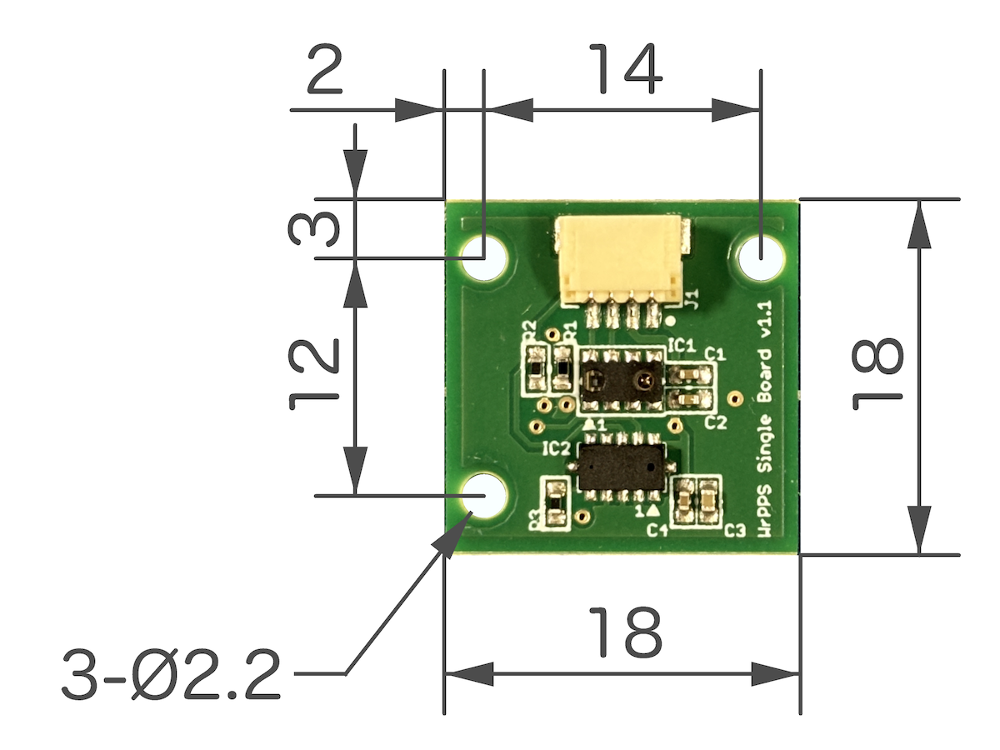

# wrpps_driver
Linux / ROS Driver Software for WrPPS Sensor Board.

---

## Hardware Outline

WrSSR Single Board is a board with proximity sensors.




- Connector Socket
  - SH Connector
    - 4 pin
    - SM04B-SRSS-TB(LF)(SN) - JST
    - https://www.jst-mfg.com/product/index.php?series=231
- Sensors
  - Time-of-Flight (ToF) Ranging Sensor
    - VL53L0X - STMicroelectronics
      - https://www.st.com/ja/imaging-and-photonics-solutions/vl53l0x.html
      - Range: ≦ 2.0 [m]
  - Proximity and Ambient Light Sensor
    - VCNL4040 - VISHAY
      - https://www.vishay.com/ja/product/84274/
      - Range: ≦ 0.2 [m]
- Dimensions
  - Width: 18 [mm]
  - Length: 18 [mm]
  - Height: 4.7 [mm]
- Weight: 1.5 [g]

### Connector Pin Asign

SH Connector<br> Pin No. | Arduino<br> Leonardo / Uno R3 | Arduino<br> nano / nano Every
:---: | :---: | :---:
1 | GND | GND
2 | 3.3V | 3.3V
3 | SDA | A4 (SDA)
4 | SCL | A5 (SCL)

<br>

## System Requirements

- Ubuntu 20.04 + ROS Noetic
- Arduino IDE 1.8.19

### Arduino Boards

The following models of the Arduino series have been confirmed to work.

- Arduino Leonardo
- Arduino Uno R3
- Arduino nano
- Arduino nano Every


## Installation

### Arduino Sketch

- test_wrpps_single_board.ino
  - https://github.com/pazeshun/jsk_apc/blob/test_wrpps_single_board/demos/sphand_ros/sphand_driver/arduino/test_wrpps_single_board/test_wrpps_single_board.ino

#### Sketch Upload

1. Connect WrPPS Single Board to Arduino (Vcc (3.3V), GND, SCL, and SDA)
2. Install Arduino IDE 1.8.9
3. Search and install VL53L0X on library manager of Arduino IDE
4. Upload test_wrpps_single_board.ino to Arduino

#### Check the Serial Communication

Once `test_wrpps_single_board.ino ` sketch has been uploaded to your Arduino, use the Arduino IDE Serial Monitor to check the operation.

When you bring your hand close to the board, the printed values should change (intensity increases and tof decreases).


### ROS Software

``` bash
mkdir -p ~/wrpps_ws/src
cd ~/wrpps_ws/src
git clone https://github.com/tork-a/wrpps_driver.git
cd ~/wrpps_ws
rosdep install -y -r --from-paths src --ignore src
catkin build
source ~/wrpps_ws/devel/setup.bash
```

<br>

## How to Use

### Launching Software

Launching `wrpps_ros.launch` including WrPPS driver and ROS publisher.

**Terminal 1**
``` bash
source ~/wrpps_ws/devel/setup.bash
roslaunch wrpps_driver wrpps_ros.launch
```

<br>

Then check the ROS topic.

Displaying a list of ROS topics.

**Terminal 2**
``` bash
source ~/wrpps_ws/devel/setup.bash
rostopic list
```

Example of running `rostopic list`

``` bash
$ rostopic list
/rosout
/rosout_agg
/wrpps_ros_publisher/range
robotuser@robotuser-PC:~/wrpps_ws/src/ 
```

Displaying ROS topic `/wrpps_ros_publisher/range`.

``` bash
rostopic echo /wrpps_ros_publisher/range
```

Example of running `rostopic echo /wrpps_ros_publisher/range`

``` bash
$ rostopic echo /wrpps_ros_publisher/range 
header: 
  seq: 1
  stamp: 
    secs: 1752729101
    nsecs: 750797510
  frame_id: "wrpps_sensor"
intensity: 3
distance: 0.721
---
header: 
  seq: 2
  stamp: 
    secs: 1752729101
    nsecs: 800770759
  frame_id: "wrpps_sensor"
intensity: 3
distance: 8.191
---
header: 

.
.
.
```


Press Ctrl-C to stop.

